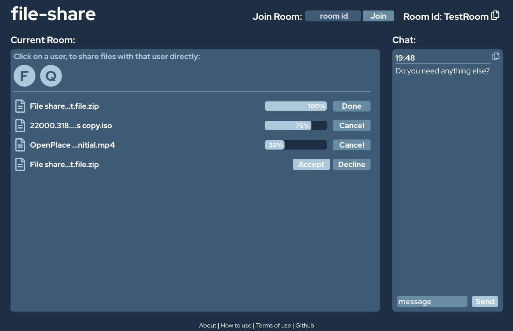

# file-share

file-share is a peer-to-peer file sharing applications, that enables secure file transfers between two clients, without either of them having to enter their credentials online or upload their data to a cloud.

## Technology

To transfer files rapidly and securely, file-share uses WebRTC under the hood. It allows peer-to-peer connection, removing the need of intermediate server and making the transfer more efficient. To connect the two peers, a [signaling server](https://github.com/benasvaleika/file-share/) is required. After connection between two peers is established, signaling server is only used for synchronizing file-share's chat and room data. The signaling server uses WebSockets for signaling.

Some devices using file-share may be hidden behind a firewall or a NAT, and be unable to establish P2P connection with it's peer (Statistically about 20% of all connections). For such cases a TURN server is required. It can be rented or self-hosted. 

In it's current state, this project does not implement a TURN server.

## Stack

- React
- Node.js
- Express.js
- Typescript
- Tailwind
- WebRTC

## TODO

- Send direction identifiers
- GUI compatability for mobile devices.
- Clipboard integration
- File preview
